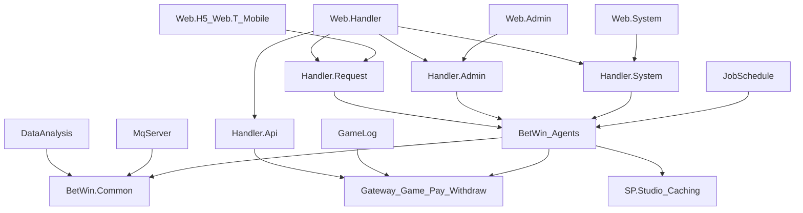

# BetWin 架构地图

## 解决方案形态

BetWin 是一个单解决方案多宿主项目。解决方案入口是 `E:\work\BetWin20250303\BetWin5.0.sln`。

整体结构可以按运行入口、请求面、业务 Agent、外部网关、后台进程和前端模板来理解。

## 运行入口

| 入口 | 形态 | 说明 |
| --- | --- | --- |
| Web.Handler | ASP.NET Handler 宿主 | 统一 HTTP 入口，加载各 Handler 程序集 |
| Handler.Request | 请求面 | 会员、代理、站点前台 |
| Handler.Admin | 请求面 | 单站点运营后台 |
| Handler.System | 请求面 | 平台与多站点治理 |
| Handler.Api | 请求面 | 游戏回调与运维接口 |
| JobSchedule | Windows 服务 | Quartz 定时任务 |
| DataAnalysis / GameLog | 后台进程 | 统计、对账、注单采集 |
| MqServer | 后台进程 | 消息消费 |

## 数据与基础设施

| 能力 | 位置 | 说明 |
| --- | --- | --- |
| 关系数据库 | SP.Studio 与 BetWin.Common | SQL Server，实体集中在 Common |
| 缓存 | BetWin.Caching | Redis，配置和用户态热点数据 |
| 消息队列 | SP.Studio.MQ 与 MqServer | Web 侧发布，MqServer 消费 |
| 搜索 | BetWin.Common ElasticSearch | 注单等日志型查询，存在索引演进 |
| 任务调度 | JobSchedule 与 BetWin Jobs | 任务定义在业务层，宿主负责运行 |
| 外部对接 | Gateway.* | 游戏、代收、代付、短信、认证插件 |

## 架构判断

这是业务交付驱动的分层单体，用 Handler 程序集和 Windows 服务做运行时隔离，而不是用 ASP.NET Core 多宿主。`Library/BetWin` 承载大部分业务复杂度，Gateway 用插件消化第三方差异。

一阶段分析时不建议立即要求它变成严格分层或升级运行时，而应先沉淀三个事实：

- 请求面已经按会员、站点后台、平台系统、回调分开。
- 异步链路集中在 JobSchedule、DataAnalysis、GameLog、MqServer。
- `Library/BetWin` 是当前演进的主要治理对象；Gateway 变更要按供应商契约逐个处理。
