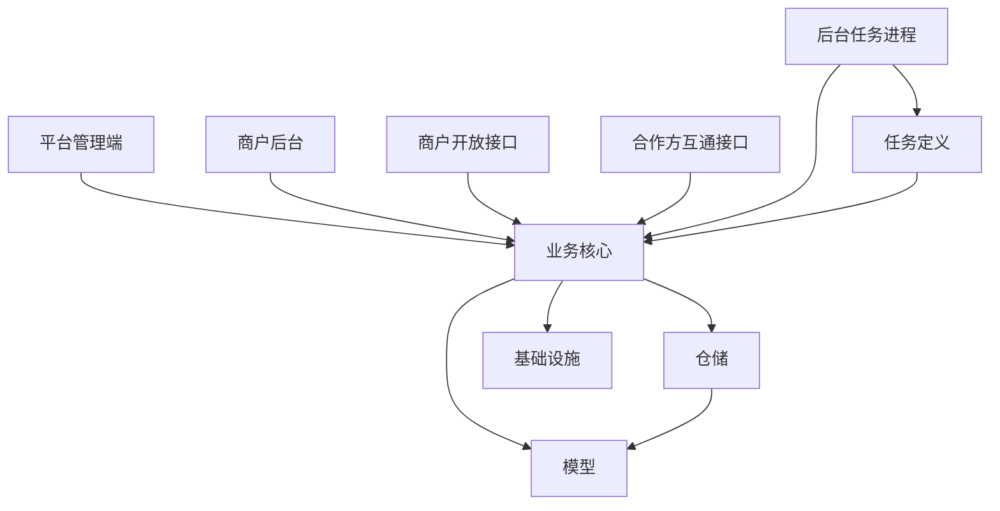

# HX.Matching 架构地图

## 解决方案形态

HX.Matching 是一个单解决方案多宿主项目。解决方案入口是 `E:\work\撮合项目\HX.Matching.sln`。

整体结构可以按运行入口、业务核心、基础设施、数据模型、任务定义和测试来理解。

## 运行入口

| 入口 | 形态 | 说明 |
| --- | --- | --- |
| 平台管理端 | 控制器 + 动态接口 | 后台管理、统计、配置、导出、通知 |
| 商户后台 | 控制器 + 动态接口 | 商户自助管理 |
| 商户开放接口 | 最小接口 | 商户代收、代付、查单、收银台 |
| 合作方互通接口 | 最小接口 | 合作方下单、查收款账户、挂单 |
| 后台任务进程 | 后台服务 + 少量接口 | 定时任务、消息消费、回调、统计、告警 |

## 数据与基础设施

| 能力 | 位置 | 说明 |
| --- | --- | --- |
| 关系数据库 | ServiceCore 与 Repository | 使用 SqlSugar，多库和分表能力在核心层附近 |
| 缓存 | Infrastructure 与 ServiceCore | 业务缓存以 Redis 为主，部分进程内缓存用于热点配置 |
| 消息队列 | Infrastructure 与 Quartz.Job | 开放接口和管理端发布消息，任务进程集中消费 |
| 搜索 | ServiceCore 与 Service | 使用 Elasticsearch，存在迁移和双集群切流相关能力 |
| 任务调度 | Tasks 与 Quartz.Job | 任务定义与运行宿主分离 |
| 日志 | 各宿主与 ServiceCore | 使用 NLog，并通过实例标记区分宿主 |

## 架构判断

这是业务交付驱动的分层单体，不是严格的纯净架构。它通过多宿主部署实现运行时隔离，通过 ServiceCore 承载大部分业务复杂度。

一阶段分析时不建议立即要求它变成严格分层，而应先沉淀三个事实：

- 热路径与管理路径已经在进程层面分开。
- 异步链路集中在任务进程，单实例风险需要被持续关注。
- ServiceCore 是当前演进的主要治理对象。
